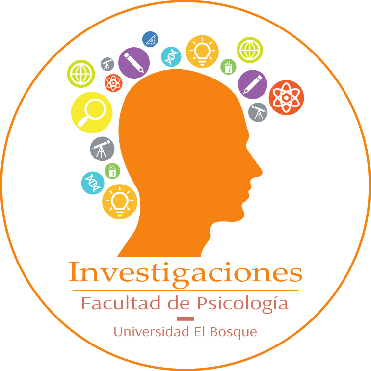

# Asesorías Metodológicas — Unidad de Investigaciones

<div align="center">
    
</div>

Sitio web del servicio de asesorías metodológicas de la **Unidad de Investigaciones, Facultad de Psicología, Universidad El Bosque** (Bogotá, Colombia).

Generado con [Hugo](https://gohugo.io/) usando [HugoBlox](https://hugoblox.com) y desplegado en [Netlify](https://www.netlify.com/).

## Descripción

Este sitio centraliza la información sobre el equipo de asesoras y asesores metodológicos de la Facultad de Psicología, los temas cubiertos, los recursos disponibles y el proceso para solicitar una asesoría. Está dirigido a docentes y estudiantes de pregrado y posgrado.

### Tipos de asesoría disponibles

| Categoría | Descripción |
| --- | --- |
| **Normas APA** | Citación, referencias y formato según APA 7.ª edición |
| **Métodos Cualitativos** | Diseño, recolección y análisis cualitativo (entrevistas, grupos focales, análisis temático) |
| **Métodos Cuantitativos** | Diseño de estudios, medición, encuestas y análisis estadístico |
| **Aspectos Éticos** | Diseño ético, consentimiento informado y comités de ética |
| **Diseños Experimentales** | Estudios experimentales y cuasiexperimentales, cálculo de tamaño de muestra |
| **Eye Tracking** | Diseño de estudios con seguimiento ocular y análisis de atención visual |
| **Estudios de Género** | Investigación desde perspectivas feministas, de género e interseccionalidad |
| **Estadística** | Descriptivos, pruebas de hipótesis, regresión, ANOVA y más |
| **Programación en R** | R y RStudio para análisis de datos, visualización e informes reproducibles |

## Estructura del proyecto

```text
├── config/           # Configuración de Hugo (tema, idioma, menús, parámetros)
├── content/
│   ├── authors/      # Perfiles de asesoras y asesores
│   ├── home/         # Secciones de la página principal
│   ├── apa/          # Página de asesorías APA
│   ├── cuali/        # Métodos Cualitativos
│   ├── cuanti/       # Métodos Cuantitativos
│   ├── etica/        # Aspectos Éticos
│   ├── exp/          # Diseños Experimentales
│   ├── eye/          # Eye Tracking
│   ├── genero/       # Estudios de Género
│   └── event/        # Eventos
├── assets/
│   ├── images/       # Logotipos e íconos
│   └── scss/         # Estilos personalizados
├── data/             # Temas y fuentes tipográficas personalizadas
└── netlify.toml      # Configuración de despliegue en Netlify
```

## Contacto

**Unidad de Investigaciones — Facultad de Psicología, Universidad El Bosque**
Av. Cra 9 No. 131 A – 02, Edificio Fundadores, Segundo Piso, Bogotá, DC
📧 cinvestigapsico@unbosque.edu.co
📞 (+57) 601-6489000 Ext. 1284

## Licencia

© Juan David Leongómez. Código fuente bajo [MIT License](LICENSE.md).
