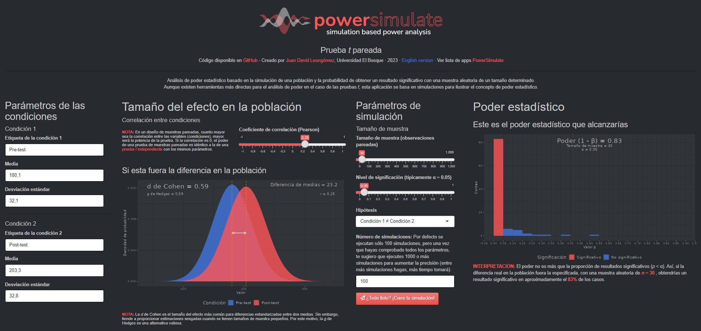

[PowerSimulate](https://shiny.jdl-svr.lat/PowerSimulate/) es una colección de aplicaciones R Shiny compactas diseñadas para llevar a cabo análisis de poder estadístico basados en simulación. 

Aunque existen herramientas más directas para el análisis de poder en pruebas simples como correlaciones, pruebas t y ANOVA, estas aplicaciones se basan exclusivamente en simulaciones. Sirven como herramienta educativa para demostrar el concepto de poder estadístico, pero también como plataforma para mostrar la importancia del análisis de poder basado en simulación para diseños más complejos.

<figure>
    
    <figcaption>Ejemplo de interfaz de una aplicación de PowerSimulate.</figcaption>
</figure>

A continuación verás el índice de aplicaciones disponibles [PowerSimulate](https://shiny.jdl-svr.lat/PowerSimulate/). Para abrir una aplicación, simplemente ve a la sección en español y haz clic en el enlace correspondiente. Ten en cuenta que existen versiones en inglés y español de cada aplicación. 

<html>
<head><title>Shiny App Iframe</title></head>
<body>
<iframe id="PowerSimulate" src="https://shiny.jdl-svr.lat/PowerSimulate" style="border: none; width: 100%; height: 1650px" frameborder="0"></iframe>
</body>
</html>

Todas las aplicaciones están disponibles en mi (bastante lento) [servidor personal Shiny](https://shiny.jdl-svr.lat/PowerSimulate/). Sin embargo, si corre demasiado lento o mi servidor no funciona, siempre puedes ejecutarla localmente en tu ordenador con R instalado. Sólo abre el link al código de GitHub, y ahí encontrarás instrucciones.
